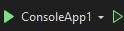
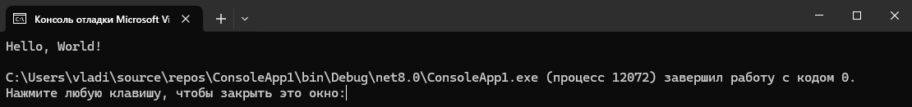

## Создание проекта
1. Показываем как скачать [**Visual Studio**](https://visualstudio.microsoft.com/ru/)
2. Какие пакеты скачивать: **разработка классических приложений .NET**
3. Запускаем VS 2022, создаем по шаблону "**Консольное приложение Майкрософт**"
## Структура программы
Весь код, который будет запущен при старте программы находится в файле **Program.cs** - это базовый файл, с которого начинается выполнение любой программы на языке C# (вне зависимости это игра или мобильное приложение).
Давайте проверим, что умеет консольное приложение и запустим его. Для этого нужно нажать на зеленую стрелку в верней панели  (сейчас разницы в них нет, так что можно выбрать любую). После запуска приложения видим следующую консоль:

В ней просто выведен текст "Привет, Мир!" и далее написано что программа завершила работу к кодом 0 - это говорит о том, что все работает как нужно.
*Закроем консоль и разберемся с кодом.*
## 
Если мы только что создали проект, мы увидим следующий код в файле **Program.cs**:
``` cs
// See https://aka.ms/new-console-template for more information
Console.WriteLine("Hello, World!");
```
Первая строчка - это комментарий, то есть просто текст, который нужен для удобства разработчиков и никак не влияет на результат. Чтобы это проверить можем удалить первую строку и еще раз запустить программу.
Вторая строка - функция `Console.WriteLine`, она печатает в консоль произвольный текст в консоль. Если посмотреть в код мы видим что там указан именно тот текст, который мы видели в консоли при запуске программы: `("Hello, World!")`, но он указан в круглых скобках, да еще и в кавычках.
**Круглые скобки** - пишутся после названия функции (`Console.WriteLine` в данном случае), в них указываются данные с которыми работает данная функция.
**Двойные кавычки** - нужны для указания текста, который мы выводим на экран, весь текст не в кавычках является названием функции или переменной.
>[!tip] Пусть ребята поменяют `"Hello, World!"` на свое имя и запустят программу

